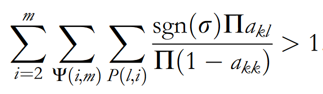

# Hastings Botsford persistence disequation
Python program to calculate Hastings Botsford Persistence from a generic NxN matrix

See: https://www.pnas.org/doi/10.1073/pnas.0506651103

The formula implemented here is


## Requirements
You'll need python 3 in order to run this project.

## Getting started
Open a command prompt.
Clone / Download this repository, and cd into it.

```bash
git clone https://github.com/xtimk/hastings-botsford-persistence.git
cd hastings-botsford-persistence
```

Create python virtual environment
```bash
python -m venv env
```

And activate it
```bash
.\env\Scripts\activate
```

Then we can install all required dependencies.
```bash
pip install -r requirements.txt
```

## How to use it
Put your input matrix into a txt file. 

For example create ```inputMatrix.txt``` and put in the following matrix
```
0    0.8  0.5  0.5
0.3  0.6  0.8  1
0.5  0.3  0.4  0.8
0    0    0.7  0.1
```

Then launch the program and specify the file containing the input matrix.
```bash
python .\hb-persistence.py inputMatrix.txt
```

The program will produce 3 outputs:

 - The generic formula 
 - A simplified formula, obtained by removing the zero elements from the generic formula
 - The actual calculation.
 - The simplified formula, with the real values from the input matrix

Output example
```bash
[INFO] 2024-08-05 15:21:30,298: Generic Full Disequation:   
   (( Q_12.0 Q_21.0)/((1 - Q_11.0)(1 - Q_22.0)))
 + (( Q_13.0 Q_31.0)/((1 - Q_11.0)(1 - Q_33.0)))
 + (( Q_14.0 Q_41.0)/((1 - Q_11.0)(1 - Q_44.0)))
 + (( Q_23.0 Q_32.0)/((1 - Q_22.0)(1 - Q_33.0)))
 + (( Q_24.0 Q_42.0)/((1 - Q_22.0)(1 - Q_44.0)))
 + (( Q_34.0 Q_43.0)/((1 - Q_33.0)(1 - Q_44.0)))
 + (( Q_12.0 Q_23.0 Q_31.0)/((1 - Q_11.0)(1 - Q_22.0)(1 - Q_33.0))) + (( Q_13.0 Q_21.0 Q_32.0)/((1 - Q_11.0)(1 - Q_22.0)(1 - Q_33.0)))
 + (( Q_12.0 Q_24.0 Q_41.0)/((1 - Q_11.0)(1 - Q_22.0)(1 - Q_44.0))) + (( Q_14.0 Q_21.0 Q_42.0)/((1 - Q_11.0)(1 - Q_22.0)(1 - Q_44.0)))
 + (( Q_13.0 Q_34.0 Q_41.0)/((1 - Q_11.0)(1 - Q_33.0)(1 - Q_44.0))) + (( Q_14.0 Q_31.0 Q_43.0)/((1 - Q_11.0)(1 - Q_33.0)(1 - Q_44.0)))
 + (( Q_23.0 Q_34.0 Q_42.0)/((1 - Q_22.0)(1 - Q_33.0)(1 - Q_44.0))) + (( Q_24.0 Q_32.0 Q_43.0)/((1 - Q_22.0)(1 - Q_33.0)(1 - Q_44.0)))
 + ((- Q_12.0 Q_21.0 Q_34.0 Q_43.0)/((1 - Q_11.0)(1 - Q_22.0)(1 - Q_33.0)(1 - Q_44.0))) + (( Q_12.0 Q_23.0 Q_34.0 Q_41.0)/((1 - Q_11.0)(1 - Q_22.0)(1 - Q_33.0)(1 - Q_44.0))) + (( Q_12.0 Q_24.0 Q_31.0 Q_43.0)/((1 - Q_11.0)(1 - Q_22.0)(1 - Q_33.0)(1 - Q_44.0))) + (( Q_13.0 Q_21.0 Q_34.0 Q_42.0)/((1 - Q_11.0)(1 - Q_22.0)(1 - Q_33.0)(1 - Q_44.0))) + ((- Q_13.0 Q_24.0 Q_31.0 Q_42.0)/((1 - Q_11.0)(1 - Q_22.0)(1 - Q_33.0)(1 - Q_44.0))) + (( Q_13.0 Q_24.0 Q_32.0 Q_41.0)/((1 - Q_11.0)(1 - Q_22.0)(1 - Q_33.0)(1 - Q_44.0))) + (( Q_14.0 Q_21.0 Q_32.0 Q_43.0)/((1 - Q_11.0)(1 - Q_22.0)(1 - Q_33.0)(1 - Q_44.0))) + (( Q_14.0 Q_23.0 Q_31.0 Q_42.0)/((1 - Q_11.0)(1 - Q_22.0)(1 - Q_33.0)(1 - Q_44.0))) + ((- Q_14.0 Q_23.0 Q_32.0 Q_41.0)/((1 - Q_11.0)(1 - Q_22.0)(1 - Q_33.0)(1 - Q_44.0))) > 1
[INFO] 2024-08-05 15:21:30,300: Generic Disequation also considering presence of zeros:
   (( Q_12.0 Q_21.0)/((1 - Q_11.0)(1 - Q_22.0)))
 + (( Q_13.0 Q_31.0)/((1 - Q_11.0)(1 - Q_33.0)))
 + (( Q_23.0 Q_32.0)/((1 - Q_22.0)(1 - Q_33.0)))
 + (( Q_34.0 Q_43.0)/((1 - Q_33.0)(1 - Q_44.0)))
 + (( Q_12.0 Q_23.0 Q_31.0)/((1 - Q_11.0)(1 - Q_22.0)(1 - Q_33.0))) + (( Q_13.0 Q_21.0 Q_32.0)/((1 - Q_11.0)(1 - Q_22.0)(1 - Q_33.0)))
 + (( Q_14.0 Q_31.0 Q_43.0)/((1 - Q_11.0)(1 - Q_33.0)(1 - Q_44.0)))
 + (( Q_24.0 Q_32.0 Q_43.0)/((1 - Q_22.0)(1 - Q_33.0)(1 - Q_44.0)))
 + ((- Q_12.0 Q_21.0 Q_34.0 Q_43.0)/((1 - Q_11.0)(1 - Q_22.0)(1 - Q_33.0)(1 - Q_44.0))) + (( Q_12.0 Q_24.0 Q_31.0 Q_43.0)/((1 - Q_11.0)(1 - Q_22.0)(1 - Q_33.0)(1 - Q_44.0))) + (( Q_14.0 Q_21.0 Q_32.0 Q_43.0)/((1 - Q_11.0)(1 - Q_22.0)(1 - Q_33.0)(1 - Q_44.0))) > 1
[INFO] 2024-08-05 15:21:30,301: Actual Disequation: 6.690740740740741 > 1
[INFO] 2024-08-05 15:21:30,301: Actual Disequation calcs:
   (( 0.8 0.3)/((1 - 0.0)(1 - 0.6)))
 + (( 0.5 0.5)/((1 - 0.0)(1 - 0.4)))
 + (( 0.8 0.3)/((1 - 0.6)(1 - 0.4)))
 + (( 0.8 0.7)/((1 - 0.4)(1 - 0.1)))
 + (( 0.8 0.8 0.5)/((1 - 0.0)(1 - 0.6)(1 - 0.4))) + (( 0.5 0.3 0.3)/((1 - 0.0)(1 - 0.6)(1 - 0.4)))
 + (( 0.5 0.5 0.7)/((1 - 0.0)(1 - 0.4)(1 - 0.1)))
 + (( 1.0 0.3 0.7)/((1 - 0.6)(1 - 0.4)(1 - 0.1)))
 + ((- 0.8 0.3 0.8 0.7)/((1 - 0.0)(1 - 0.6)(1 - 0.4)(1 - 0.1))) + (( 0.8 1.0 0.5 0.7)/((1 - 0.0)(1 - 0.6)(1 - 0.4)(1 - 0.1))) + (( 0.5 0.3 0.3 0.7)/((1 - 0.0)(1 - 0.6)(1 - 0.4)(1 - 0.1))) > 1
[INFO] 2024-08-05 15:21:30,302: All done
```

Output will be printed to console and into ```hb-pers.log``` file.

## Debugging problems
Feel free to contribute and/or open Issues if you find any bug/problem.
You can get some more detailed infos by running program in DEBUG mode. In order to set DEBUG mode, edit line 11 of hb-persistence.py, and set 
```python
level = logging.DEBUG
```
